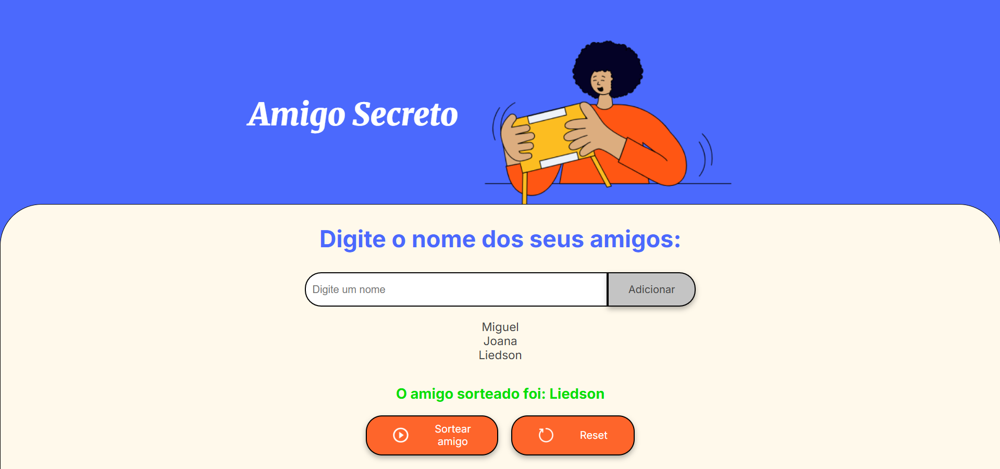

# 🎁 Challenge Amigo Secreto - ONE Alura

Projeto simples em **JavaScript, HTML e CSS** para cadastrar amigos e sortear aleatoriamente um nome da lista.  

---

## 🌐 Acesse o Projeto

👉 [Clique aqui para abrir o site](https://liedsoon.github.io/Challenge-ALURA_ONE/)

---

## 🚀 Funcionalidades

- Adicionar amigos em uma lista.
- Validação para não permitir nomes vazios.
- Exibição dinâmica dos nomes adicionados.
- Sorteio de um amigo aleatório.

---

## 📸 Demonstração

  

---

## 🛠️ Tecnologias Utilizadas

- **HTML5**
- **CSS3**
- **JavaScript**

---

## ▶️ Como Usar

👉 [Clique aqui para abrir o site](https://liedsoon.github.io/Challenge-ALURA_ONE/)

## 📁 Clone o repositório

1. Clone o repositório:
   ```bash
   git clone https://github.com/liedsoon/Challenge-ALURA_ONE
   ```
2. Abra o arquivo `index.html` no navegador.
3. Digite o nome dos amigos no campo de texto e clique em **Adicionar**.
4. Clique em **Sortear** para escolher aleatoriamente um amigo da lista.

---


